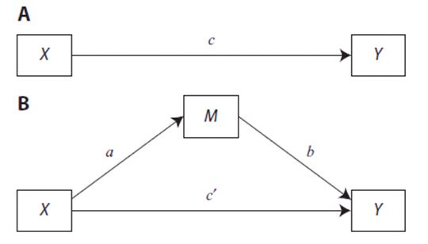

```{r setup, include=FALSE}
knitr::opts_chunk$set(echo = FALSE)
library(learnr)
hint_text <- function(text, text_color = "#E69F00"){
  hint <- paste("<font color='", text_color, "'>", text, "</font>", sep = "")
  return(hint)
}

```

# Mediation

## Overview

This tutorial focuses on learning about mediation. The tutorial includes a combination of videos, text, knowledge check quizzes, and exercises. 

The PowerPoint slides for the presentation in the videos are on Canvas if you want a copy. For those not enrolled in my class, these files can be found here: https://osf.io/9tgxm/ 

The videos (as well as others) can also be found on my YouTube channel https://www.youtube.com/channel/UC5kDZTyHZlgSgSEa3YQXOig 

## Packages 

This tutorial uses the following packages:

* `lavaan` for complex models
* `learnr` and `shiny` and `rmarkdown` for aspects of the tutorial

These packages should be automatically loaded within this tutorial (but you already installed `learnr` if you are here). If you are working outside of this tutorial (e.g., working with the data files and trying analysis in R) then you need to make sure that the necessary packages are installed on your computer.

## Data

All data files exist within this package, so we can simply call them without reference to a file location. 

*mednomiss* These data represent 534 white college students' evaluations of African Americans. Measures address quality of contact experiences (**quality**), intergroup anxiety (**anxiety**), stereotype endorsement (**stereo**), perceptions of symbolic (**symbolic**) and realistic threats (**realistic**), and attitudes (**att**)

*med* is a version of the same data that includes some variables with missing values to allow for demonstration of some additional functions in `lavaan`. 

*Mindful* is the datafile used in exercises. These data are from:
Zheng, S., Sun, S., Huang, C., & Zou, Z. (2020). Authenticity and subjective well-being: The mediating role of mindfulness. *Journal of Research in Personality*, *84*, 103900. https://doi.org/10.1016/j.jrp.2019.103900

The version of the datafile includes the variables **SelfAware** (Self Awareness), **LifeSat** (Life Satistfaction), and **Mindful** (overall mindfulness). There are also four mindfulness subscales **OBE** (Observing), **DES** (Describing), **ACT** (Acting with Awareness), and **JUD** (Non Judgmental). We will use some of subscales when examining multiple mediators. 

All files are on the class' Google Share drive if you want to work with them outside of the tutorial. They are already loaded in this tutorial so you will not need to load the data as you work. (Note: If you are not in my class, these files can be found here: https://osf.io/9tgxm/).

Videos generally range from about 10 to 15 minutes long (there are five of them).

## Video 1 Basics & Definitions


## Quiz 1 Basics



```{r quiz1}
learnr::quiz(
  learnr::question("What is path c called?",
    learnr::answer("Total Effect", correct = TRUE),
    learnr::answer("Indirect Effect"),
    learnr::answer("Direct Effect"),
    learnr::answer("Mediated Effect"),
    correct = "Correct! The c path is the relationship between the IV and DV with no other predictors in the model.",
    incorrect = "Sorry, that's incorrect. Try again.",
    random_answer_order = TRUE,
    allow_retry = T
  ),
  learnr::question("What is path c-prime called?",
    learnr::answer("Direct Effect", correct = TRUE),
    learnr::answer("Indirect Effect"),
    learnr::answer("Total Effect"),
    learnr::answer("Mediated Effect"),
    correct = "Correct. The direct effect is what remains explained by the IV once the mediator is entered in the model",
    random_answer_order = TRUE,
    incorrect = "Sorry, that's incorrect. Try again.",
    allow_retry = T
  ),
  learnr::question("The reduction in the relationship between the IV and DV from panel A to panel B in the graph can be calculated by ... ",
    learnr::answer("Taking the difference between c and c-prime", correct = TRUE),
    learnr::answer("Multiplying c times c-prime"),
    learnr::answer("Adding c and c-prime together"),
    learnr::answer("Dividing c by c-prime"),
    correct = "Correct!",
    incorrect = "Incorrect. Please try again.",
    random_answer_order = TRUE,
    allow_retry = T
  ),
  learnr::question("The reduction in the relationship between the IV and DV from panel A to panel B represents the ...  ",
    learnr::answer("Indirect Effect", correct = TRUE),
    learnr::answer("Direct Effect"),
    learnr::answer("Total Effect"),
    learnr::answer("Nothing"),
    correct = "Correct!",
    incorrect = "Incorrect. Please try again.",
    random_answer_order = TRUE,
    allow_retry = T
 ),
  learnr::question("One version of the calculation of the indirect effect involves ...  ",
    learnr::answer("Multiplying the a path by the b path", correct = TRUE),
    learnr::answer("Dividing a by b"),
    learnr::answer("Multiplying c by c-prime"),
    learnr::answer("Dividing b by a"),
    correct = "Correct!",
    incorrect = "Incorrect. Please try again.",
    random_answer_order = TRUE,
    allow_retry = T
  ),
  learnr::question("You have three variables, self-esteem, social identity, and ingroup bias. Your hypothesis is that the relationship between self-esteem and ingroup bias is strongest when social identity is high and weakens as social identity decreases, your prediction is an example of ... ",
    learnr::answer("Moderation", correct = TRUE),
    learnr::answer("Mediation"),
    learnr::answer("A main effect"),
    correct = "Correct! When the relationship between the IV and DV depends on the level of a third variable, that variable is moderating the relationship",
    incorrect = "Incorrect. Please try again.",
    random_answer_order = TRUE,
    allow_retry = T
  ),
  learnr::question("You have three variables, self-esteem, social identity, and ingroup bias. Your hypothesis is that stronger social identities produce greater self-esteem which in turn leads to more ingroup bias, your prediction is an example of ... ",
    learnr::answer("Mediation", correct = TRUE),
    learnr::answer("Moderation"),
    learnr::answer("A main effect"),
    learnr::answer("An interaction"),
    correct = "Correct! Mediation is all about there being a process. X leads to M which in turn leads to Y",
    incorrect = "Incorrect. Please try again.",
    random_answer_order = TRUE,
    allow_retry = T
  )
)

``` 

## Video 2 Single Mediator


## Quiz 2 

```{r quiz2}
learnr::quiz(
  learnr::question("What is the first step in the Baron & Kenny approach to mediation?",
    learnr::answer("Establish that the predictor (x) and outcome (y) are related", correct = TRUE),
    learnr::answer("Establish that the predictor (x) and mediator (m) are related"),
    learnr::answer("Establish that the mediator (m) relates to the outcome (y) in the presence of the predictor (x)"),
    learnr::answer("Test the indirect effect (ab) for significance"),
    correct = "Correct!",
    incorrect = "Sorry, that's incorrect. Try again.",
    random_answer_order = TRUE,
    allow_retry = T
  ),
  learnr::question("What is the second step in the Baron & Kenny approach to mediation?",
    learnr::answer("Establish that the predictor (x) and outcome (y) are related"),
    learnr::answer("Establish that the predictor (x) and mediator (m) are related", correct = TRUE),
    learnr::answer("Establish that the mediator (m) relates to the outcome (y) in the presence of the predictor (x)"),
    learnr::answer("Test the indirect effect (ab) for significance"),
    correct = "Correct.",
    random_answer_order = TRUE,
    incorrect = "Sorry, that's incorrect. Try again.",
    allow_retry = T
    
  ),
  learnr::question("What is the third step in the Baron & Kenny approach to mediation?",
    learnr::answer("Establish that the predictor (x) and outcome (y) are related"),
    learnr::answer("Establish that the predictor (x) and mediator (m) are related"),
    learnr::answer("Establish that the mediator (m) relates to the outcome (y) in the presence of the predictor (x)", correct = TRUE),
    learnr::answer("Test the indirect effect (ab) for significance"),
    correct = "Correct!",
    incorrect = "Sorry, that's incorrect. Try again.",
    random_answer_order = TRUE,
    allow_retry = T
  ),
  learnr::question("What is the final step in the Baron & Kenny approach to mediation?",
    learnr::answer("Establish that the predictor (x) and outcome (y) are related"),
    learnr::answer("Establish that the predictor (x) and mediator (m) are related"),
    learnr::answer("Establish that the mediator (m) relates to the outcome (y) in the presence of the predictor (x)"),
    learnr::answer("Test the indirect effect (ab) for significance", correct = TRUE),
    correct = "Correct!",
    incorrect = "Sorry, that's incorrect. Try again.",
    random_answer_order = TRUE,
    allow_retry = T
)
)
``` 


## Calculation exercise 


For the model above imagine that we established a total effect = .5 and the direct effect = .3. 

```{r quiz3}
learnr::quiz(
  learnr::question("Which path is the total effect?",
    learnr::answer("c", correct = TRUE),
    learnr::answer("c-prime"),
    learnr::answer("a"),
    learnr::answer("b"),
    correct = "Correct!",
    incorrect = "Sorry, that's incorrect. Try again.",
    random_answer_order = TRUE,
    allow_retry = T
  ),
    learnr::question("Which path is the direct effect?",
    learnr::answer("c"),
    learnr::answer("c-prime", correct = TRUE),
    learnr::answer("a"),
    learnr::answer("b"),
    correct = "Correct!",
    incorrect = "Sorry, that's incorrect. Try again.",
    random_answer_order = TRUE,
    allow_retry = T
  ),
    learnr::question("What would the size of the indirect effect be for this example?",
    learnr::answer(".2", correct = TRUE),
    learnr::answer(".5"),
    learnr::answer(".3"),
    learnr::answer("Cannot be determined without paths a and b"),
    correct = "Correct! c-c-prime, the reduction in the size of the total effect after adding the mediator. This is reflects as total effect minus direct effect.",
    incorrect = "Sorry, that's incorrect. Try again.",
    random_answer_order = TRUE,
    allow_retry = T
  ),
    learnr::question("If the 95% confidence interval around the indirect effect was -.10 to .80, what would be the correct conclusion?",
    learnr::answer("There is no evidence for an indirect effect", correct = TRUE),
    learnr::answer("We would need a z-test to make this determination"),
    learnr::answer("There is evidence for an indirect effect"),
    correct = "Correct! The 95% CI includes 0, so the effect is not significant",
    incorrect = "Sorry, that's incorrect. Try again.",
    random_answer_order = TRUE,
    allow_retry = T
    ),
    learnr::question("For another model, you know that a = .5 and b = .2 but do not know the c or c-prime paths. What is the size of the indirect effect?",
    learnr::answer(".1", correct = TRUE),
    learnr::answer(".5"),
    learnr::answer(".2"),
    learnr::answer(".3"),
    learnr::answer("Cannot be determined"),
    correct = "Correct! ab = .5*.2 = .1",
    incorrect = "Sorry, that's incorrect. Try again.",
    random_answer_order = TRUE,
    allow_retry = T
  )
)
```

## Video 3 R Packages

This video covers using various packages in R to run mediation analyses. 


## `lavaan` code example

```{r echo = T, eval = F}
set.seed(1234)
model <- ' 
att ~ cp*quality
 
anxiety ~ a*quality
att ~ b*anxiety
 
ab := a*b
# total effect 
total := cp + (a*b)
'
fitm <- lavaan::sem(model, data = hand11nomiss, se="bootstrap")
lavaan::summary(fitm, ci=TRUE)
``` 

The code above builds and runs a basic mediation model using `lavaan`. We'll go through each line and then you will adapt this code to a different dataset and variables. Below we will go through line by line with text below the code explaining what is going on. 

```{r echo = T, eval = F}
set.seed(1234)
```

The set.seed command ensure that your analysis reproduces exactly. This is important when using bootstrapped estimates. Without set.seed, estimation starts at a different location each time, meaning results will differ slightly. 

```{r echo = T, eval = F}
model <- '
(stuff goes in here)

'
```

Here (above) we are building our model. You can call the model whatever you want.

```{r echo = T, eval = F}
att ~ cp*quality
```

In `lavaan`, we can extract a value for various calculations by using a label(cp, in this case) and the * symbol. This piece in the model statement establishes the direct effect (cp stands for c-prime). Here we predict att from quality and label the resulting path as cp. 

```{r echo = T, eval = F}
anxiety ~ a*quality
```

Predict anxiety from quality and assign that as a. (Note: these labels can be whatever, I'm just being consistent with the figure we've seen several times).


```{r echo = T, eval = F}
att ~ b*anxiety
```

Here we establish the path between the mediator and attitudes and call that the b path. 

```{r echo = T, eval = F}
ab := a*b
```

This line calculates the indirect effect. The := function means "calculate this."

```{r echo = T, eval = F}
total := cp + (a*b)
```

Calculates the total effect (i.e., y predicted by x without m in the equation). We know c-cp = ab, so cp+ab = c. 


```{r echo = T, eval = F}
fitm <- lavaan::sem(model, data = hand11nomiss, se="bootstrap")
lavaan::summary(fitm, ci=TRUE)
```

These two lines run the model. se = "bootstrap" bootstraps the CIs, however, it makes the code run pretty slow. The summary statement then tells `lavaan` to actually print the CIs. 


## Running analyses in `lavaan`

The dataset *Mindful* contains several variables. For the purpose of this exercise we focus on Self Awareness (**SelfAware**), **Mindfulness**, and Life Satisfaction (**LifeSat**). The research question addresses whether mindfulness mediates the relationship between self-awareness and life satisfaction. 

Adapt the code below to the new problem. The code will likely take about 20-30 seconds to run, so be patient.

```{r echo = T, eval = F}
set.seed(1234)
model <- ' 
att ~ cp*quality
anxiety ~ a*quality
att ~ b*anxiety
ab := a*b
total := cp + (a*b)
'
fitm <- lavaan::sem(model, data = hand11nomiss, se="bootstrap")
lavaan::summary(fitm, ci=TRUE)
``` 

```{r ECHO=F}
Mindful<-MVstats::Mindful
```

```{r ex1, exercise = TRUE, exercise.lines = 10}

```

```{r ex1-solution}
set.seed(1234)
model <- ' 
LifeSat ~ cp*SelfAware
Mindfulness ~ a*SelfAware
LifeSat ~ b*Mindfulness
ab := a*b
total := cp + (a*b)
'
fitm <- lavaan::sem(model, data = Mindful, se="bootstrap")
lavaan::summary(fitm, ci=TRUE)
```

## Interpret mindfulness analysis

```{r}
set.seed(1234)
model <- ' 
LifeSat ~ cp*SelfAware
Mindfulness ~ a*SelfAware
LifeSat ~ b*Mindfulness
ab := a*b
total := cp + (a*b)
'
fitm <- lavaan::sem(model, data = Mindful, se="bootstrap")
lavaan::summary(fitm, ci=TRUE)
```

Use the output to address the following questions. 

This quiz focuses on aspects of the `lavaan` code. 

```{r quiz5}
learnr::quiz(
  learnr::question ("What was the 95% confidence interval for the total effect? Was it significant?",
    learnr::answer("[0.20,0.41]; significant", correct = TRUE),
    learnr::answer("[0.20,0.41]; not significant"),
    learnr::answer("[0.06,0.16]; significant"),
    learnr::answer("total effect was not calculated"),
    correct = "Correct! Zero falls outside the 95%CI so we can conclude there was a significant relationship between self-awareness and life satisfaction. This satisfies the first Baron and Kenny criteria.",
    incorrect = "Sorry, that's incorrect. Try again.",
    random_answer_order = TRUE,
    allow_retry = T
  ),
    learnr::question("Is self awareness related to mindfulness? Which 95% CI addresses that question?",
    learnr::answer("No. 95% CI is [0.18, 0.37]"),
    learnr::answer("Yes. 95% CI is [0.26, 0.48]", correct = TRUE),
    learnr::answer("Yes. 95% CI is [0.10, 0.31]"),
    learnr::answer("Yes. 95% CI is [0.06, 0.41]"),
    correct = "Correct! This satisfies the 2nd Baron and Kenny criteria",
    incorrect = "Sorry, that's incorrect. Try again.",
    random_answer_order = TRUE,
    allow_retry = T
  ),
    learnr::question("Is mindfulness related to life satisfaction? Which 95% CI addresses that question?",
    learnr::answer("Yes. 95% CI is [0.26, 0.48]"),
    learnr::answer("Yes. 95% CI is [0.18, 0.37]", correct = TRUE),
    learnr::answer("No. 95% CI is [0.10, 0.31]"),
    learnr::answer("Yes. 95% CI is [0.06, 0.41]"),
    correct = "Correct! This satisfies the 3rd Baron and Kenny criteria",
    incorrect = "Sorry, that's incorrect. Try again.",
    random_answer_order = TRUE,
    allow_retry = T
  ),
      learnr::question("Does self awareness relate to life satisfaction in the presence of the mediator? Which 95% CI addresses that question?",
    learnr::answer("No. 95% CI is [0.26, 0.48]"),
    learnr::answer("Yes. 95% CI is [0.18, 0.37]"),
    learnr::answer("Yes. 95% CI is [0.10, 0.31]", correct = TRUE),
    learnr::answer("Yes. 95% CI is [0.06, 0.41]"),
    correct = "Correct!",
    incorrect = "Sorry, that's incorrect. Try again.",
    random_answer_order = TRUE,
    allow_retry = T
  )
,
      learnr::question("Is there evidence for an indirect effect?",
    learnr::answer("Yes.", correct = TRUE),
    learnr::answer("No"),
    learnr::answer("There is insufficient evident to determine"),
    correct = "Correct! The ab path's 95% CI is [0.055, 0.160]. This excludes 0 so we can say there is an indirect effect",
    incorrect = "Sorry, that's incorrect. Try again.",
    random_answer_order = TRUE,
    allow_retry = T
  )
)
```

## Video 4 Multiple Mediators


## R Code for Multiple Mediators

This section reviews the `lavaan` code for running multiple mediator models. First, we'll see the full code then review aspects of the code and output. As before look below the code block for comments on the specific code.

```{r echo= T, eval=F}
model <- '
att ~ cp*quality
 
stereo ~ a1*quality
anxiety ~ a2*quality
symbolic ~ a3*quality
realistic ~ a4*quality

att ~ b1*stereo
att ~ b2*anxiety
att ~ b3*symbolic
att ~ b4*realistic

 
totalind := abs(a1*b1)+abs(a2*b2)+abs(a3*b3)+abs(a4*b4) 
a1b1 := a1*b1
a2b2 := a2*b2
a3b3 := a3*b3
a4b4 := a4*b4

 
c1v2 := (a1*b1)-(a2*b2)
c1v3 := (a1*b1)-(a3*b3)
c1v4 := (a1*b1)-(a4*b4)
c2v3 := (a2*b2)-(a3*b3)
c2v4 := (a2*b2)-(a4*b4)
c3v4 := (a3*b3)-(a4*b4)

 
total := cp + (a1*b1)+(a2*b2)+(a3*b3)+(a4*b4)

 
stereo~~anxiety
stereo~~symbolic
stereo~~realistic
anxiety~~symbolic
anxiety~~realistic
symbolic~~realistic

'
fitm2 <- lavaan::sem(model, data = hand11b, se="bootstrap", missing="ML")
lavaan::summary(fitm2, ci=TRUE)
```

Now, line by line. 

```{r echo= T, eval=F}
model <- ' # 
att ~ cp*quality
```

Attitude is still predicted by cp*quality. There is only one direct path as there remains a single predictor and a single dv (complex models can have two or more of both).


```{r echo= T, eval=F}
stereo ~ a1*quality
anxiety ~ a2*quality
symbolic ~ a3*quality
realistic ~ a4*quality
```

These are the mediators. Each is being predicted by quality to form the a paths (predictor to mediator). Be sure to use a consistent order here (e.g. always use 1 for formulae involving stereo and 2 for those involving anxiety).

```{r echo= T, eval=F}
att ~ b1*stereo
att ~ b2*anxiety
att ~ b3*symbolic
att ~ b4*realistic
```

These are the paths from each mediator to the dv (the b paths). Note how 1 is used for stereo, etc. in order to be consistent across the analyses. 

```{r echo= T, eval=F}
totalind := abs(a1*b1)+abs(a2*b2)+abs(a3*b3)+abs(a4*b4) 
a1b1 := a1*b1
a2b2 := a2*b2
a3b3 := a3*b3
a4b4 := a4*b4
```

Here are the indirect effects. Each a path times its corresponding b path.

```{r echo= T, eval=F}
c1v2 := (a1*b1)-(a2*b2)
c1v3 := (a1*b1)-(a3*b3)
c1v4 := (a1*b1)-(a4*b4)
c2v3 := (a2*b2)-(a3*b3)
c2v4 := (a2*b2)-(a4*b4)
c3v4 := (a3*b3)-(a4*b4)
```

These are the contrasts. I used the notation 1v2 to indicate what was being compared. 1 = Stereotype, 2 = Anxiety, 3 = Symbolic, and 4 = Realistic (this is why we need to be consistent in the labeling!). The final one c3v4 therefore compares Symbolic (3) and Realistic (4). 

```{r echo= T, eval=F}
total := cp + (a1*b1)+(a2*b2)+(a3*b3)+(a4*b4)

stereo~~anxiety
stereo~~symbolic
stereo~~realistic
anxiety~~symbolic
anxiety~~realistic
symbolic~~realistic
```

The total effect now includes all the indirect effects. Alternatively, this could have been cp + totalind.

The correlations between all of the mediators are required for a correct solution. The ~~ estimates a correlation. 

```{r echo= T, eval=F}
fitm2 <- lavaan::sem(model, data = hand11b, se="bootstrap", missing="ML")
lavaan::summary(fitm2, ci=TRUE)
```

Finally, we run and summarize. As before we used se = "bootstrap" to get our confidence intervals. Missing = "ML" deals with missing data using Maximum Likelihood estimation. Alternatively, you could create 20 multiply imputed datasets and run this code on all 20 ... but that would take forever. 

## Exercise Multiple Mediators

For this exercise, you will use the *Mindful* data and focus on Self Awareness (**SelfAware**) and Life Satisfaction (**LifeSat**). Instead of using the overall measure of mindfulness, for this example we use the four mindfulness subscales **OBE** (Observing), **DES** (Describing), **ACT** (Acting with Awareness), and **JUD** (Non Judgmental) as our mediators. Adapt the code below to our dataset.

```{r echo = T, eval=F}
model <- '
att ~ cp*quality
stereo ~ a1*quality
anxiety ~ a2*quality
symbolic ~ a3*quality
realistic ~ a4*quality
att ~ b1*stereo
att ~ b2*anxiety
att ~ b3*symbolic
att ~ b4*realistic
totalind := abs(a1*b1)+abs(a2*b2)+abs(a3*b3)+abs(a4*b4) 
a1b1 := a1*b1
a2b2 := a2*b2
a3b3 := a3*b3
a4b4 := a4*b4
c1v2 := (a1*b1)-(a2*b2)
c1v3 := (a1*b1)-(a3*b3)
c1v4 := (a1*b1)-(a4*b4)
c2v3 := (a2*b2)-(a3*b3)
c2v4 := (a2*b2)-(a4*b4)
c3v4 := (a3*b3)-(a4*b4)
total := cp + (a1*b1)+(a2*b2)+(a3*b3)+(a4*b4)
stereo~~anxiety
stereo~~symbolic
stereo~~realistic
anxiety~~symbolic
anxiety~~realistic
symbolic~~realistic
'
fitm2 <- lavaan::sem(model, data = hand11b, se="bootstrap", missing="ML")
lavaan::summary(fitm2, ci=TRUE)
```

Adapt your code below. This analysis might take a minute, so don't get frustrated if nothing happens immediately. The summary command here is a `lavaan` command, not the base R summary that we use all the time. 

NOTE: It appears that the se="bootstrap" command conflicts with the `learnr` environment for this analysis (it likely uses too many resources). If you are getting an error such as *!is.null(BOOT) is not TRUE* you can remove the se="bootstrap" part of the sem command and the code should run (but it won't give the same 95% CI as the bootstrapped errors).  

```{r echo=F}
library(lavaan)
```

```{r ex2, exercise = TRUE, exercise.lines = 40}

```

```{r ex2-solution}
model <- '
LifeSat ~ cp*SelfAware
OBE ~ a1*SelfAware
DES ~ a2*SelfAware
ACT ~ a3*SelfAware
JUD ~ a4*SelfAware
LifeSat ~ b1*OBE
LifeSat ~ b2*DES
LifeSat ~ b3*ACT
LifeSat ~ b4*JUD
totalind := abs(a1*b1)+abs(a2*b2)+abs(a3*b3)+abs(a4*b4) 
a1b1 := a1*b1
a2b2 := a2*b2
a3b3 := a3*b3
a4b4 := a4*b4
c1v2 := (a1*b1)-(a2*b2)
c1v3 := (a1*b1)-(a3*b3)
c1v4 := (a1*b1)-(a4*b4)
c2v3 := (a2*b2)-(a3*b3)
c2v4 := (a2*b2)-(a4*b4)
c3v4 := (a3*b3)-(a4*b4)
total := cp + (a1*b1)+(a2*b2)+(a3*b3)+(a4*b4)
OBE~~DES
OBE~~ACT
OBE~~JUD
DES~~ACT
DES~~JUD
ACT~~JUD
'
fitm <- lavaan::sem(model, data = Mindful, missing="ML")
lavaan::summary(fitm, ci=TRUE)
```

## Interpreting output

Here is a highly edited version of the output for our analysis using bootstrapped CIs. A quiz follows. 


```{r quiz6}
learnr::quiz(
  learnr::question ("Which indirect effects were statistically significant?",
    learnr::answer("Totalind, DES, and ACT", correct = TRUE),
    learnr::answer("Totalind, OBE, and DES"),
    learnr::answer("Totalind, OBE, and JUD"),
    learnr::answer("Totalind only"),
    correct = "Correct!",
    incorrect = "Sorry, that's incorrect. Try again.",
    random_answer_order = TRUE,
    allow_retry = T
  ),
    learnr::question("What was the total effect (total, not total indirect?",
    learnr::answer("0.308", correct = TRUE),
    learnr::answer("0.113"),
    learnr::answer("0.195"),
    learnr::answer("There is no total effect"),
    correct = "Correct! This would be noted as c in our model",
    random_answer_order = TRUE,
    allow_retry = T
  ),
    learnr::question("What was the direct effect?",
    learnr::answer("0.308"), 
    learnr::answer("0.113"),
    learnr::answer("0.195", correct = TRUE),
    learnr::answer("There is no direct effect"),
    correct = "Correct! This would be cp (c-prime) in our model",
    incorrect = "Sorry, that's incorrect. Try again.",
    random_answer_order = TRUE,
    allow_retry = T
  ),
      learnr::question("Subtract c - cprime. What effect does this correspond to?",
    learnr::answer("None of them"),
    learnr::answer("The direct effect"),
    learnr::answer("The total indirect effect", correct = TRUE),
    learnr::answer("The first indirect effect (a1b1)"),
    correct = "Correct! This is a nice reminder regarding the relationship between total, direct, and indirect. Written another way, total = direct + indirect",
    incorrect = "Sorry, that's incorrect. Try again.",
    random_answer_order = TRUE,
    allow_retry = T
  )
)
```


## Video 5 Additional Issues


## Additional Issues

Additional Issues Quiz

```{r quiz7}
learnr::quiz(
  learnr::question ("What characterizes partial mediation?",
    learnr::answer("A significant indirect effect and a significant direct effect", correct = TRUE),
    learnr::answer("A significant indirect effect and a significant total effect"),
    learnr::answer("A non-significant indirect effect and a significant direct effect"),
    learnr::answer("A significant indirect effect. The other effects do not matter"),
    correct = "Correct!",
    incorrect = "Sorry, that's incorrect. Try again.",
    random_answer_order = TRUE,
    allow_retry = T
  ),
    learnr::question("What characterizes complete mediation?",
       learnr::answer("A significant indirect effect and a significant direct effect"),
    learnr::answer("A significant indirect effect and a significant total effect"),
    learnr::answer("A significant indirect effect and a non-significant direct effect",correct = TRUE),
    learnr::answer("A significant indirect effect. The other effects do not matter"),
    correct = "Correct!",
    random_answer_order = TRUE,
    allow_retry = T
  ),
    learnr::question("Flipping the predictor and mediator paths establishes the correct causal direction in cross-sectional data?",
    learnr::answer("It depends"), 
    learnr::answer("True "),
    learnr::answer("False", correct = TRUE),
    correct = "Correct! This is one of the few times that 'it depends' is not the right answer",
    incorrect = "Sorry, that's incorrect. Try again.",
    random_answer_order = TRUE,
    allow_retry = T
  ),
      learnr::question("How can we establish causal mediation?",
    learnr::answer("A large, well-powered sample"),
    learnr::answer("By demonstrating complete mediation"),
    learnr::answer("Through experimental or longitudinal designs", correct = TRUE),
    learnr::answer("It is impossible to establish causality"),
    correct = "Correct! Statistics only get us so far. Research design drives the sort of claims we can make. Statistical results are necessary but not sufficient to establishing causal mediation",
    incorrect = "Sorry, that's incorrect. Try again.",
    random_answer_order = TRUE,
    allow_retry = T
  ),
      learnr::question("According to Andrew Hayes - author of Beyond Baron and Kenny ...",
    learnr::answer("The Sobel test should be avoided in place of bootstrapped estimates"),
    learnr::answer("A total effect is not required to establish mediation"),
    learnr::answer("All of these", correct = TRUE),
    learnr::answer("Mediation and moderation can exist in the same design"),
    correct = "Correct! Cogratulation on finishing our last tutorial!",
    incorrect = "Sorry, that's incorrect. Try again.",
    random_answer_order = TRUE,
    allow_retry = T
  )
)
```

You've reached the end of the tutorial. If you found this useful and enjoyable, please tell a friend. 
